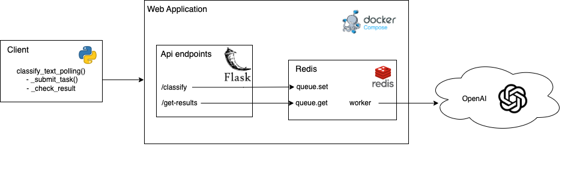

# Text Classification WebApp
Simple text classification into predefined classes using LLMs. The application is build as a webapp using Flask, a messaging system with Redis, everything organised with Docker compose. It also contains a simple client to interact with the webapp.

## Architecture


This is a sample web application is designed around a text classification task using Language Models (LLMs). The application is built using Python and Flask for the web server, Redis for the messaging system, and Docker/Docker-compose for containerization and orchestration.  The application consists of four main components:
 1. **Web Server** (web/app.py): This is a Flask application that exposes two endpoints, /classify and /get-result/<task_id>. The /classify endpoint accepts POST requests with the text to be classified, temperature, and model name. It validates the input, generates a unique task ID, and pushes the task to a Redis queue. The classification task (/classify) is non blocking, meaning that it immediately return a response, but not the classification result. The /get-result/<task_id> endpoint accepts GET requests with a task ID and returns the result of the task if it's completed.  
 2. **Client** (client/client.py): This is a Python script that interacts with the web server. It simulates a request in polling. It submits a classification task to the server and polls for the result at a given interval. The client handles the communication with the server, error handling, and result retrieval.  
 3. **Tests** (tests/*): This includes load tests using Locust to test the performance of the web application and some unit tests. The load test simulate user behavior by sending requests to the /classify endpoint and fetching results from the /get-result/<task_id> endpoint.
 4. **Evaluation** (evaluation/evaluate.py): This includes the evaluation of the model.

## Launch the webapp
To launch the webapp, you need to have `Docker` installed on your machine. 
First create a `.env` file in the root directory of the project and add you OPENAI_API_KEY variable:
```makefile
OPENAI_API_KEY=sk-...
DEBUG=False
```
Then you can launch the server using the following command:
```bash
docker-compose up --build
```

## Client
The client is a simple python script that sends a request to the webapp to classify the text. The client is located in the `client` directory. You can see the example_usage.ipynb notebook to see how to use the client.

## Tests

### Load test
I have created a simple load test using `locust` to test the performance of the webapp. The test is located in the `tests` directory. To run the test, you need to install `locust` using the following command:
```bash
cd tests
pip install locust
```
Then, you can run the test using the following command:
```bash
locust --host=http://localhost:8000
```
After running the command, you can open the browser and go to `http://localhost:8089` to start the test.
I have tested the webapp using my local machine and tested the performance of the webapp with requests of 1000 requests per second. The webapp was able to handle the requests without any issues.
#### NOTE:
It is likely that after the load test, you will have to flush the redis queue. You can do that by running the following command:
```bash
docker exec -it text-classification-webapp_redis_1 redis-cli flushall
```
Check if `text-classification-webapp_redis_1` is the name of your redis instance. Substitute it with the correct name if it is different.

### Unit tests
To run the unit tests, you need to install the requirements, and then you can run the tests using the following command:
```bash 
pyton -m unittest discover
```

## Future work
 - Add more tests
 - Build a simple frontend for the webapp in JS ad React
 - Improve the test prompts in evaluation